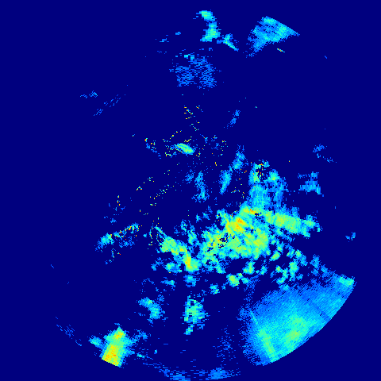
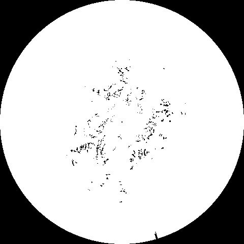
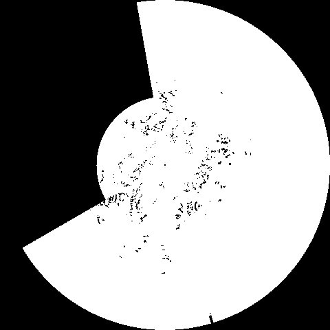
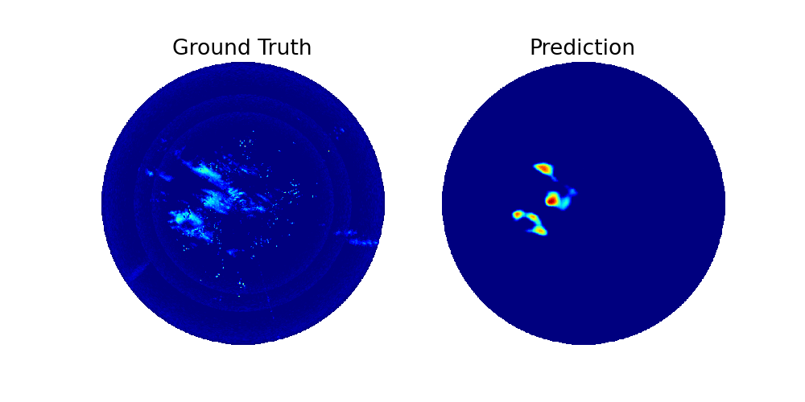

# CS230 Nowcasting Project: Notes 

## TAASRAD19

The basic model we will work with takes an HDF5 file consisting of radar images of precipitation sequences and outputs a prediction of the future precipitation.

From a single rain sequence, you can see noise artifacts (due to mountain peaks reflecting radar signal):


Therefore, the publishers apply an outlier mask as part of the data preprocessing, as below.



One potential source of novelty is to update the mask.png file to account for regions of extreme radar beam blockage. 


## Interacting with data

### TAASRAD19 dataset

#### HDF5 File Format

The dataset in hdf_archives consists of sequences of precipitation events, with a separate hdf5 file for each day with precipitation. Within each day's hdf5 file, sequences are indexed by a string integer i.e. '0', '1', etc

The sequence shape is: (nframes,480,480), with each frame taken 5 minutes apart.


Information about sequences are captured in hdf_metadata.csv, as shown below.

id,start_datetime,end_datetime,run_length,avg_cell_value,tags
0,2010-11-01 00:00:00,2010-11-01 13:35:00,164,4.91796875,rain snow

#### Predictions and modeling:

The TAASRAD19 model predicts radar up to 100 minutes ahead (20 frames) at full spatial resolution, based on 25 min (5 frames) of data. The model is based on the "TrajGRU architecture, implemented using Apache MXNet. Training and validation are extracted with a moving-window strategy; first 5 frames are used as input, next 20 frames are used as ground truth for validation testing.

Here's a sample dataset:


#### How to generate predictions with the TAASRAD19 codebase:

To generate predictions using the pretrained model weights on CPU:
```
python predict.py \
    --model_cfg  pretrained_model/cfg0.yml \
    --model_dir  pretrained_model \
    --model_iter 99999 \
    --save_dir  /path/output \
    --data_dir  /path/to/tassrad19/sequences \
    --date_start 2017-01-01 \
    --date_end   2017-03-01 \
    --ctx cpu \
    --batch_size 4
```

Use `python predict.py --help` to see all options

Predictions are saved in as numpy array in npz format. 
For each TAASRAD19 sequence 3 files are generated in `save_dir`:
input (`in`), ground truth (`gt`) and prediction (`pred`) sequences.

For example for the following TAASRAD19 sequence:
```
start_datetime    2017-01-12 14:20:00
end_datetime      2017-01-12 23:55:00
run_length                        116
```

The generated output is:
```
-201701121440_in_92.npz
|____________|__|__| 
       |      |   |
  start time  |   |
              |   |
            type  |
                  |
         nr. of subsequences
           (5 frames each)

-201701121440_pred_92.npz
|____________|____|__| 
       |       |    |
  start time   |    |
               |    |
             type   |
                    |
           nr. of subsequences
            (20 frames each)

-201701121440_gt_92.npz
|____________|__|__| 
       |      |   |
  start time  |   |
              |   |
            type  |
                  |
         nr. of subsequences
          (20 frames each)
```

To view the files:
```
from numpy import load

data = load([npz directory])
```


#### Random AWS notes
While creating new venv, noticed that the disk was completely full. Upgraded disk size to 200GB, and removed two anaconda venvs: mxnet_p36 and tensorflow2_p37


## Helpful Tutorials
## Remember to stop EC2 instance once done with your session
### Tutorial for connecting to AWS using VSCode (Mitty)

1. Install the Remote - SSH (<https://marketplace.visualstudio.com/items?itemName=ms-vscode-remote.remote-ssh>) extension from the vscode marketplace.
2. Open Command Palette (on the menu bar, choose View, Command Palette) or use shortcut keys:
    - Windows and Linux – Press Ctrl+Shift+P.
    - macOS – Press Shift+Command+P.

3. Select: “Remote-ssh: connect to host” -> “Configure SSH host” -> choose your config file
    - normally, should be ```Users/[username]/.ssh/config```

4. Add to script:

    ```
    Host aws-ec2
    HostName ec2-35-84-93-34.us-west-2.compute.amazonaws.com
    User ubuntu
    IdentityFile ~/.ssh/cs230_aws_key.pem
    ```

5. Save the config file and open the command palette and “Remote-ssh: connect to host”. You should see aws-ec2 in the list.

### Tutorial for using virtual env (Mitty)

- To activate the virtual environment, type the following in command line:
``` /tmp/cs230/bin/activate ```
- To deactivate, just type ```deactivate``` in command line
- To install package: ```pip3 install <package name>```
- To see what package is already installed: ```pip3 list```

Virtual environment can help us manage our packages. If you want your own environment with your desired packages, you can simply create your own virtual environment with ```virtualenv /tmp/<environment name>``` and then install the packages you want.

## Other helpful stuff:

check cuda version: 
```
nvcc-version
```

to keep track of nividia-smi interface:
```
watch -n0.1 nvidia-smi
```

To activate the environment, go to /home/ubuntu, then:

source nowcasting/bin/activate


## notes from running the training:

using all years from 2010-2017 is prohibitively difficult: too much data, runs too slowly. 5+ min per day of data, so will take hours per iteration. Need each iteration to take less than 20 minutes!!! Cost $3/hr, budget roughly 50 experiments/iterations to try. Other chunk of time needed is for generating actual data!

## Experiments run 6/7/23:
CG = ConvGRU

TG = TrajGRU

CL  = ConvLSTM

PATH for train output: /home/ubuntu/gitrepo/CS230_Nowcasting/deep_learning_nowcasting

PATH for model output: /home/ubuntu/data/modelOut/

### [TG,TG,TG] [v2Mask] ITER = 9
/trainOutput/baselineOutputwNewMask
/home/ubuntu/data/modelOut/TGTGTG_v2Mask

### [TG,TG,TG] [v2Mask] ITER = 50???
/trainOutput/blOutNewMask_iterx
<!-- /home/ubuntu/data/modelOut/TGTGTG_v2Mask -->

### [TG,TG,TG] [v1Mask] ITER = 9
/trainOutput/baselineOutput_v1Mask
<!-- /home/ubuntu/data/modelOut/TGTGTG_v2Mask -->

### [CG,CG,CG] [v2Mask]
/trainOutput/convGRU_3x